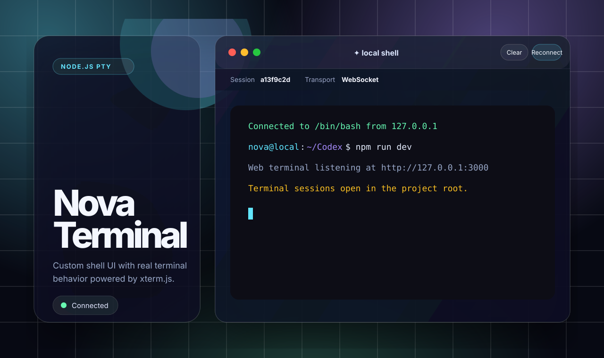

# Nova Terminal



Nova Terminal is a beautiful browser-based shell for local development. The UI is custom-built for this project, while the terminal emulation layer uses xterm.js because ANSI parsing, cursor addressing, scrollback, selection, and resize behavior are exactly the hard parts a real terminal should not fake.

## What it includes

- A polished glassmorphism terminal workspace in `public/`.
- A Node.js backend in `server/`.
- A WebSocket endpoint at `/terminal`.
- A real pseudo-terminal powered by `node-pty`.
- Resize support through the xterm fit addon.
- Clear and reconnect controls in the toolbar.
- Starter scripts for Linux, macOS, Windows Command Prompt, and Windows PowerShell.

## Quick start

Pick the launcher for your operating system. Each launcher installs dependencies if `node_modules/` is missing, starts the Node.js server, opens the app in your browser, and sets terminal sessions to start in this project directory.

| OS / shell | Launcher |
| --- | --- |
| Linux / WSL / Git Bash | `./start.sh` |
| macOS Terminal | `./start.sh` |
| macOS Finder double-click | `start.command` |
| Windows Command Prompt | `start.bat` |
| Windows PowerShell | `./start.ps1` |

You can still run it manually:

```bash
npm install
npm run dev
```

Then open [http://127.0.0.1:3000](http://127.0.0.1:3000).

## Configuration

You can change the bind address, port, terminal shell, or terminal working directory with environment variables:

```bash
HOST=127.0.0.1 PORT=4000 TERMINAL_SHELL=/bin/zsh TERMINAL_CWD="$PWD" ./start.sh
```

On Windows PowerShell:

```powershell
$env:PORT = "4000"
$env:TERMINAL_SHELL = "powershell.exe"
./start.ps1
```

Set `NO_OPEN=1` if you do not want the starter to open your browser automatically.

## Security warning

This application exposes shell access through a browser. By default, the server binds to `127.0.0.1` so it is only available locally. Do not bind it to a public interface unless you add authentication, authorization, TLS, audit logging, and strict session controls.

Recommended production hardening:

1. Require authentication before opening `/terminal`.
2. Run the PTY as an unprivileged user inside a container or sandbox.
3. Restrict working directories and environment variables.
4. Add rate limits and session timeouts.
5. Put the service behind HTTPS/WSS.

## Why xterm.js?

We build the product shell, layout, theme, controls, connection UX, launchers, and backend ourselves. We use xterm.js only for robust terminal emulation, because reproducing full terminal behavior from scratch would mean rebuilding years of ANSI/VT compatibility work before the app could be useful.
